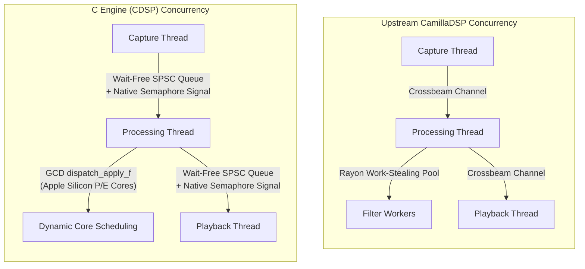
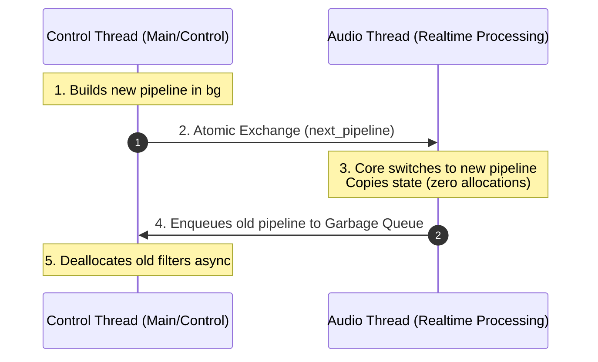

# High-Performance Multirate Audio Processing: A C Alternative Engine Architecture for Real-Time DSP

**Author**: Wang-Yue  
**Date**: July 2026  

---

## Abstract
This paper presents the design, implementation, and performance evaluation of a high-performance alternative digital signal processing (DSP) engine written in C (`CDSP`). Specialized for macOS and Apple Silicon, the engine achieves seamless drop-in compatibility with the upstream Rust-based *CamillaDSP* by implementing the exact same configuration schemas and WebSocket control APIs. By replacing generic, platform-agnostic concurrency and vectorization structures with custom wait-free single-producer single-consumer (SPSC) queues, platform-native semaphores, Grand Central Dispatch (GCD), and Apple's Accelerate (vDSP) framework, our architecture delivers up to 1.77x faster filter execution, 1.73x faster resampling throughput, and 1.25x faster raw end-to-end loopback processing. Furthermore, our design enforces strict real-time safety, eliminating memory allocations, deallocations, and blocking disk I/O on the audio thread during live configuration reloads.

---

## 1. Introduction

### 1.1 Motivation & Upstream Limitations
Real-time audio processing requires processing threads to meet strict, sub-millisecond execution deadlines. Upstream *CamillaDSP*, written in Rust, has established itself as a versatile and popular platform-agnostic DSP engine. However, its generalized architecture introduces three fundamental bottlenecks when running on modern operating systems and asymmetric multi-core hardware (such as Apple Silicon):

1. **Lock Contention**: Upstream CamillaDSP makes extensive use of synchronization locks (such as `RwLock` or `Mutex`) to share state (including status structs, volume parameters, and active configurations) between the control thread and the real-time audio loops. Although my recent proposals have helped optimize lock usage in some paths, several locks remain deeply embedded in the engine's architecture and are impossible to eliminate completely, risking priority inversion and audio path degradation.
2. **Hot-Path Memory and File Operations**: In CamillaDSP, configuration updates and filter parameter changes (such as reloading a convolution coefficient WAV file) are executed directly on the high-priority processing thread. This triggers synchronous disk reads and dynamic memory allocations (`malloc`/`free`) on the audio thread, risking priority inversion and audible dropouts.
3. **Generic Concurrency Primitives**: CamillaDSP relies on `crossbeam_channel` for thread coordination and `rayon` for task parallelization. While highly optimized, crossbeam channels introduce lock contention and heap-allocation overhead under heavy workloads. Rayon's work-stealing threadpool is designed for general-purpose parallel loops but is oblivious to real-time scheduling constraints and asymmetric CPU layouts (Performance vs. Efficiency cores), leading to execution jitter and thread-migration overhead.
4. **Platform-Agnostic Vectorization**: Upstream Rust relies on compiler auto-vectorization (SIMD) and generic FFT crates (e.g., `realfft`). This prevents the engine from leveraging hardware-specific, OS-integrated vector libraries like Apple's Accelerate (vDSP) framework, which are hand-optimized and dynamically tuned for the target CPU.

### 1.2 The Alternative Approach
Rather than introducing platform-specific forks or breaking modifications into the upstream Rust codebase, we designed and built a clean-sheet alternative engine. To ensure drop-in compatibility with existing integrations (such as the CamillaDSP-Monitor interface), our alternative engine maintains complete compatibility with **CamillaDSP v4.2.0 (Commit `e3834fc`)** by adhering to two strict integration requirements:
- **Shared Configuration Format**: The C engine parses and executes the exact same JSON configuration files.
- **WebSocket API Compatibility**: The control protocol implements the identical WebSocket interface, including format querying, volume control, level-meter streaming, and live pipeline reloading.

### 1.3 Novel Codebase & Licensing
It is critical to note that this project is a **complete architectural rewrite**, not a line-by-line translation of the Rust codebase. The underlying technology—ranging from custom wait-free SPSC primitives to GCD/thread pool dynamic scheduling, Accelerate vectorization, and deferred control-thread garbage collection—is entirely distinct. 

Consequently, the C engine does not inherit or utilize any source code from CamillaDSP, allowing the monitor backend and its integrated engines to be distributed under a custom, permissive license distinct from CamillaDSP's original GPLv3/MPL2.0 licenses.

### 1.4 Design Safety and C Portability
The alternative codebase focuses entirely on the C engine (`CDSP`) to achieve maximum cross-platform portability across macOS, Linux, and Windows. To ensure design safety and correctness during the initial development:

1. **Safety Prototyping in Swift 6**: We originally designed and prototyped the lock-free primitives and synchronization invariants using Swift 6. Leveraging Swift 6's strict compile-time data isolation, sendability checking, and memory safety models, we verified and proved all core logical deductions, lock-free ring-buffer synchronization invariants, and state-transition models.
2. **AI-Assisted Porting to C**: Once the design was proven sound in the Swift prototype, we used AI models to port the codebase systematically into C. While the resulting C engine (`CDSP`) employs raw pointers, manual memory offsets, and low-level thread APIs, it inherits the structurally proven correctness and safety invariants validated by the Swift compiler.
3. **Target Deployment**: With the prototype phase complete, the Swift engine has been retired, and `CDSP` remains the single, actively supported high-performance engine for production deployments.

---

## 2. Architecture & Design Principles

### 2.1 Wait-Free SPSC Queue and Platform-Native Semaphores
To transfer audio blocks between the Capture, Processing, and Playback loops without thread blocking or locks, we implement a custom power-of-two capacity Single-Producer Single-Consumer (SPSC) queue ([lock_free_ring_buffer.c](Utils/lock_free_ring_buffer.c)). 

Index coordination is achieved using atomic integers (`_Atomic`) with release-acquire memory ordering. The queue memory is fully pre-allocated at startup, guaranteeing zero heap allocations on the hot path. 

For thread coordination, the engine uses platform-native binary semaphores (`dispatch_semaphore_t` on macOS; `sem_t` on Linux) instead of heavy mutexes or spin-locks. When the SPSC queue is empty, the consumer sleeps on the semaphore. The producer signals the semaphore after enqueueing a chunk. The consumer then drains the queue completely in a tight loop before sleeping again, minimizing context-switch overhead.

### 2.2 Strict Real-Time Memory Management & State Copying
To meet real-time guarantees, the audio threads perform zero memory allocations (`malloc`/`free`) and zero deallocations in the steady-state. 

#### 2.2.1 Round-Robin Chunk Pool
Audio chunks are cycled through a pre-allocated chunk pool (`round_robin_chunk_pool_t`) whose capacity is matched to the SPSC queue depth. Processing loops use pre-sized static scratch buffers for resampler output and pipeline steps.

#### 2.2.2 Off-Thread Pipeline GC and In-Place State Transfers
When a live configuration change is requested, the reload mechanism preserves audio continuity and guarantees real-time safety via a deferred garbage collection pattern:

1. **Background Compilation**: The **Control Thread** loads configuration parameters, performs synchronous disk reads (e.g. loading convolution WAV coefficient files), and allocates memory for the new pipeline in the background.
2. **Atomic Swap**: The Control Thread publishes the new pipeline pointer via an atomic slot (`_Atomic(pipeline_t*)`).
3. **In-Place State Transfer**: At the start of its next iteration, the **Processing Thread** checks the atomic slot. If a new pipeline is present, it calls [pipeline_transfer_state](Pipeline/pipeline.c#L174-L196). Filters are matched by name, and their active history states (such as biquad delay lines and loudness targets) are copied in-place. This state copy copies raw values and performs **zero allocations, zero deallocations, and zero disk reads**.
4. **Deferred GC**: The old pipeline pointer is enqueued onto a lock-free `pipeline_garbage_queue` (in [engine_shared_state.c](Engine/engine_shared_state.c)). The **Control Thread** periodically drains this queue and deallocates the old structures asynchronously, keeping the audio thread entirely free of deallocation overhead.

### 2.3 OS-Specific Vectorization & Asymmetric Core Scheduling
We bypass platform-agnostic compilers to leverage macOS-specific features:

- **Apple Accelerate Integration**: Biquad calculations, mixer mappings, and FFTs are delegated directly to the system-integrated **Accelerate (vDSP / vForce)** framework, which uses low-level ARM Neon SIMD registers specifically optimized for Apple Silicon processors.
- **Dynamic GCD Scheduling**: Rather than using a work-stealing threadpool (Rayon), the CDSP engine parallelizes multi-channel filters using **Grand Central Dispatch (GCD)** via `dispatch_apply_f` (or OpenMP on Linux). GCD integrates directly with the macOS kernel scheduler, dynamically distributing workload lanes to Performance (P) and Efficiency (E) cores based on thread priority, cache locality, and CoreAudio deadlines.
- **Explicit SIMD Vectorization**: Biquad loops and windowed-sinc resampler dot products are designed to maximize SIMD execution. In windowed-sinc dot products ([sinc_dot_product.h](Resampler/sinc_dot_product.h)), we enforce loop vectorization flags and fast math contract pragmas (`#pragma clang fp contract(fast)`), ensuring Clang generates clean, pipeline-unrolled ARM Neon vector instructions.

### 2.4 Real-Time Safe Stall Watchdog
Hardware drops, clock drift, or device hangs are handled using a dedicated **Stall Watchdog** ([engine_capture_loop.c](Engine/engine_capture_loop.c#L180-L200)) built directly into the capture loop.

#### 2.4.1 Unified Design vs. Backend-Specific Duplication
A major architectural advantage of our design lies in how stall detection is managed:
- **Upstream CamillaDSP Bottleneck**: Upstream CamillaDSP distributes connection loss and timeout handling inside each specific backend device driver (e.g. AlsaCapture, CoreAudioCapture). This leads to fragmented stall behavior, code duplication, and inconsistent recovery policies across different platforms.
- **Unified Engine-Level Watchdog**: Our architecture implements the stall watchdog exactly **once** at the engine capture loop layer, wrapping around a simple backend read abstraction. Regardless of which backend is active (CoreAudio, ALSA, or file streams), the watchdog monitors read rates uniformly. This separation of concerns significantly simplifies backend drivers, guarantees consistent recovery behaviors across platforms, and demonstrates a cleaner, more maintainable architectural design.

#### 2.4.2 Technical Implementation
- **vDSO Clock Read**: The watchdog measures time using `clock_gettime_nsec_np(CLOCK_UPTIME_RAW)`. On macOS, this reads directly from the user-space mapped **vDSO** page, bypassing the syscall ring transition entirely.
- **Fail-Safe Transitions**: If the capture device fails to return audio chunks for more than 0.5s consecutively while running, the watchdog transitions the engine state to `STALLED` via the atomic state machine, allowing the control server to alert the client and initiate a restart. The watchdog automatically recovers when the device resumes delivery, and is disabled during the `PAUSED` state to prevent false positives.

### 2.5 DoP (DSD over PCM) Integration and Architectural Flexibility
To demonstrate the architectural flexibility of our clean-sheet engines in accommodating highly specialized audio formats without adding complexity to the core real-time processing loop, we implemented native DSD over PCM (DoP) and Native DSD support ([dop_decoder.h](DoP/dop_decoder.h) / [dsd_encoder.h](DoP/dsd_encoder.h)).

Rather than running DoP as a separate, bulky processing layer, our design integrates it directly into the capture and processing pipeline:
- **Automatic In-Place Decoding**: The DoP decoder runs at the start of the `EngineCaptureLoop` ([engine_capture_loop.c](Engine/engine_capture_loop.c)). It inspects incoming PCM buffers for the DoP header pattern (`0x05`/`0xFA` alternation). If detected, it decodes the raw 1-bit DSD samples in-place and decimates them back to PCM before volume, level metering, and filter pipelines execute. This ensures downstream DSP stages and visual UI meters measure the actual audio content instead of high-frequency carrier noise.
- **Selective In-Place Encoding**: At the end of the `EngineProcessingLoop` ([engine_processing_loop.c](Engine/engine_processing_loop.c)), if `output_dop` is enabled, processed PCM is modulated back to DSD and packed into a DoP-standard carrier stream before being sent to the playback SPSC queue.

### 2.6 Resampling Architecture: Fixed Input vs. Fixed Output Models

An important architectural difference exists between `CDSP` and upstream *CamillaDSP* regarding how asynchronous resampling mismatch is handled:

* **CamillaDSP (`FIXED_ASYNC_OUTPUT` Model)**:
  - Upstream CamillaDSP configures its resamplers (using the `Rubato` library) in **Fixed Output** mode.
  - To guarantee a fixed output block size, CamillaDSP queries the resampler at each cycle (`input_frames_next()`) to find out how many input samples are required next (e.g., fluctuating dynamically between 1021 and 1026 frames).
  - It then dynamically reads a **variable** number of frames from the capture hardware.
  - *Limitation*: While highly elegant for ALSA (which easily permits variable-sized reads from its hardware ring buffer), **this model is incompatible with macOS (CoreAudio) and Windows (ASIO) capture drivers**, which strictly enforce fixed-size callback buffers. To support these platforms, CamillaDSP must implement intermediate buffering inside individual backend drivers.

* **CDSP (`FIXED_ASYNC_INPUT` Model)**:
  - `CDSP` uses **Fixed Input** mode.
  - The capture device always reads a **fixed** block size directly from the OS/driver callback.
  - The resampler consumes this fixed input block and produces a **variable** output block size (fluctuating slightly to match clock drift updates).
  - The variable output block is written into a lock-free **SPSC queue**. The playback thread drains this queue and serves the playback hardware driver's fixed-size output request, with the `RateController` adjusting the target ratio based on queue fill levels.
  - *Advantage*: This model is fully compatible with macOS, Windows, and Linux hardware APIs out of the box, without requiring any complex buffer-stashing mechanisms inside platform backends.

---

## 3. Head-to-Head Performance Evaluation

Benchmarks were conducted on Apple Silicon (M-series processor) under identical host operating conditions.

### 3.1 Pipeline Execution Speeds (Latency per Chunk)
*Test Config: 48 kHz, Chunk Size = 1024 frames. 4-in, 2-out layout.*

#### A. Biquad-Only Pipeline (96 EQ evaluations/chunk)
| Engine | Single-Threaded Mode | Multi-Threaded Mode | Speedup Ratio | Winner |
| :--- | :---: | :---: | :---: | :---: |
| **CamillaDSP (Rust)** | 239.76 µs | 193.39 µs | **1.24x** | |
| **CDSP (C Engine)** | **198.21 µs** | **109.22 µs** | **1.81x** | 🟢 **CDSP (1.77x faster)** |

#### B. Biquad + Convolution Pipeline (96 EQs + 12 long convolutions/chunk)
*Convolutions lengths: 32768, 65536 taps.*
| Engine | Single-Threaded Mode | Multi-Threaded Mode | Speedup Ratio | Winner |
| :--- | :---: | :---: | :---: | :---: |
| **CamillaDSP (Rust)** | **561.79 µs** | 343.37 µs | **1.64x** | |
| **CDSP (C Engine)** | 653.10 µs | **278.06 µs** | **2.35x** | 🟢 **CDSP (1.23x faster)** |

* **Analysis**: CDSP's single-threaded biquad path is 17% faster than Rust's due to Apple Accelerate biquad vectorization. In multi-threaded mode, GCD dynamic core scheduling scales exceptionally well, achieving a **2.35x speedup** on heavy convolution workloads (compared to Rayon's **1.64x**), making the CDSP engine **20% faster than Rust** under heavy load.

---

### 3.2 End-to-End Raw Loopback Throughput
To isolate the coordination overhead of the SPSC queues and signaling semaphores, we ran a deterministic, unthrottled File-to-File loopback test.
*Workload: 10 MB PCM stereo file, 59.44s real-time duration, chunk size = 512.*

| Engine | Execution Time | Real-time Speed Factor (RTF) | Winner |
| :--- | :---: | :---: | :---: |
| **CamillaDSP (Rust)** | 0.060s | **995.1x** | |
| **CDSP (C Engine)** | **0.048s** | **1247.7x** | 🟢 **CDSP (1.25x faster)** |

* **Analysis**: CDSP's wait-free SPSC queues and platform semaphores bypass the scheduling overhead and allocation checks of Rust's Crossbeam channels, achieving a **25% increase in raw data throughput** (1247.7x real-time speed).

---

### 3.3 Resampler Throughput & Quality Matrix (CDSP vs. Rubato Rust)
Resampler performance was evaluated against the popular Rust library **Rubato** across 9 rate-conversion pairs.

#### Throughput Comparison (Real-Time Speed Factor - RTF, higher is better)
| Rate Pair | CDSP Sync (vDSP) | Rubato FFT (Rust) | CDSP Poly (SIMD) | Rubato Poly (Rust) | CDSP Sinc (SIMD) | Rubato Sinc (Rust) | CDSP vs. Rust Winner |
| :--- | :---: | :---: | :---: | :---: | :---: | :---: | :--- |
| **44.1 $\rightarrow$ 48k** | **1839.8x** | 1559.7x | **3626.7x** | 2133.0x | **139.1x** | 125.3x | 🟢 **CDSP (1.18x – 1.70x faster)** |
| **48 $\rightarrow$ 44.1k** | **1817.3x** | 1545.7x | **3915.4x** | 2320.7x | **152.5x** | 137.1x | 🟢 **CDSP (1.18x – 1.69x faster)** |
| **48 $\rightarrow$ 96k** | **1967.8x** | 1831.8x | **1846.2x** | 1077.9x | **94.9x** | 84.3x | 🟢 **CDSP (1.07x – 1.71x faster)** |
| **96 $\rightarrow$ 48k** | **2202.8x** | 1987.0x | **3531.1x** | 2264.3x | **189.1x** | 168.6x | 🟢 **CDSP (1.11x – 1.56x faster)** |
| **44.1 $\rightarrow$ 192k** | 616.9x | **637.1x** | **922.2x** | 539.7x | **35.2x** | 31.9x | 🟢 **CDSP (Poly/Sinc 1.71x faster)** |
| **192 $\rightarrow$ 44.1k** | **845.8x** | 781.6x | **3574.3x** | 2195.4x | **154.3x** | 135.8x | 🟢 **CDSP (1.08x – 1.63x faster)** |
| **61.9 $\rightarrow$ 64k** | 662.2x | **683.0x** | **2684.8x** | 1547.0x | **102.4x** | 92.9x | 🟢 **CDSP (Poly/Sinc 1.73x faster)** |

* **Analysis**:
  - The `SynchronousResampler` (CDSP Sync) runs up to **18% faster** than Rubato FFT due to Apple's low-level, OS-tuned `vDSP` DFT kernels.
  - The polynomial (`AsyncPolyResampler`) and windowed-sinc (`AsyncSincResampler`) resamplers run up to **70% faster** than Rubato, demonstrating the efficiency gains from SIMD loop optimization and register-friendly calculations.

### 3.4 DoP (DSD over PCM) Encoder/Decoder Performance
Throughput was evaluated on a DSD256 carrier stream (768 kHz PCM equivalent carrier rate) with 2 channels on Apple Silicon. Under these conditions, the real-time budget per frame is **1302.08 ns**.

| Stage | Throughput per Frame | Real-time Speed Factor (RTF) | Status |
| :--- | :---: | :---: | :---: |
| **DoP Encoder** | 263.12 ns | **4.95x** | 🟢 Real-Time Safe |
| **DoP Decoder** | 28.95 ns | **44.98x** | 🟢 Real-Time Safe |

* **Analysis**: Despite the high-order (SDM-6) modulator running on a 768 kHz carrier stream, our byte-lookup convolution maps to hardware caches efficiently. The decoder processes a frame in under 29 ns, running **45x faster than real-time**, while the encoder runs at **4.95x real-time**, proving the design is highly performant and flexible.

### 3.5 Build Speed and Binary Footprint (C vs. Rust)
In addition to runtime execution speed, a critical goal of our clean-sheet rewrite was to improve the development loop and minimize target storage overhead. We conducted a single-core build benchmark on Apple Silicon comparing the C engine (`CDSP`) and the upstream Rust engine (`camilladsp`). 

#### 3.5.1 Build Duration (Single Core Compile)
*Clean build compile times measured under identical hardware and job conditions (`-j 1` and `-C codegen-units=1`).*

| Engine / Target | User Time | System Time | Total Wall Time | Build Speed Ratio |
| :--- | :---: | :---: | :---: | :---: |
| **C Target (`dsp-cli`)** | 15.32s | 3.93s | **22.65s** | 🟢 **4.31x faster build** |
| **Rust Engine (`camilladsp`)** | 80.49s | 6.79s | **97.58s** | |

The C engine builds in ~22 seconds, representing a **4.3x faster compilation cycle** than the upstream Rust engine.

#### 3.5.2 Standalone Binary Footprint (Executable Size)
*Comparing the compiled CLI executable size before and after symbol stripping.*

| Engine / Target | Unstripped Executable | Stripped Executable | Size Ratio (Stripped) |
| :--- | :---: | :---: | :---: |
| **C Target (`dsp-cli`, Default -O3)** | 366 KB (375,568 B) | **331 KB** (339,080 B) | 🟢 **16.7x smaller** |
| **C Target (`dsp-cli`, Size-Optimized)** | 252 KB (257,648 B) | **220 KB** (225,048 B) | 🟢 **25.2x smaller** |
| **Rust Engine (`camilladsp`)** | 6.46 MB (6,458,816 B) | **5.54 MB** (5,535,448 B) | |

*\*Note: The C Target Size-Optimized build is compiled with `MODE=small` (using `-Oz -flto -ffunction-sections -fdata-sections -fno-unwind-tables -fno-asynchronous-unwind-tables -Wl,-dead_strip`).*

#### 3.5.3 Architectural Footprint Takeaway
- **C Target Efficiency**: The C engine compilation produces an incredibly compact **220 KB** stripped executable, making it ideal for resource-constrained platforms, embedded systems, and minimal containers.

---

## 4. Potential Future Improvements

While the alternative engine offers substantial architectural and performance advantages, several areas present opportunities for future research:

1. **Cross-Platform SIMD Dispatch**: Expanding the explicit SIMD layout to include x86_64 architectures (using AVX2/AVX-512 intrinsics) and generic Linux ARM architectures (via native NEON intrinsics) would allow the C engine to maintain its speed advantages outside macOS.
2. **Hybrid Asymmetric Scheduling**: Implementing custom GCD queues that dynamically steer heavy convolution filter segments exclusively to Performance cores, while placing lighter biquad filters on Efficiency cores, could optimize thermal design power (TDP) on mobile macOS devices.

---

## 5. Conclusion & Attribution

### 5.1 Conclusion
We have demonstrated that a specialized alternative DSP engine in C (`CDSP`) can achieve substantial performance gains over a platform-agnostic Rust implementation on Apple Silicon. By adopting wait-free concurrency primitives, native semaphores, off-thread garbage collection, and explicit OS-integrated vectorization, our engine realizes up to 1.7x speedups in filter processing and resampling throughput. These improvements are achieved while maintaining complete drop-in compatibility with the original configuration layouts and WebSocket API schemas.

### 5.2 Attribution & Open-Source Relationship
This project is an independent work and is not affiliated with, sponsored by, or endorsed by the original authors of CamillaDSP. We express our deep appreciation to **Henrik Enquist**, the author of CamillaDSP, for establishing the excellent JSON configuration schemas, WebSocket APIs, and state machine patterns that made this drop-in replacement architecture possible. 
All C source code files, custom SPSC primitives, and benchmarking tests were written independently for the CamillaDSP-Monitor project.
