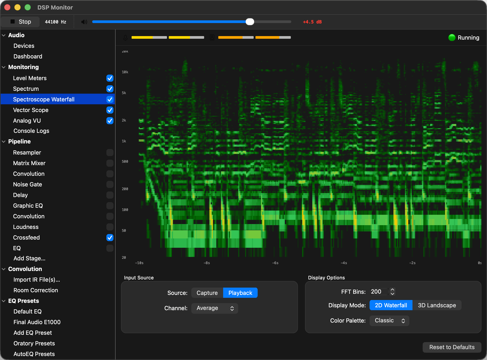
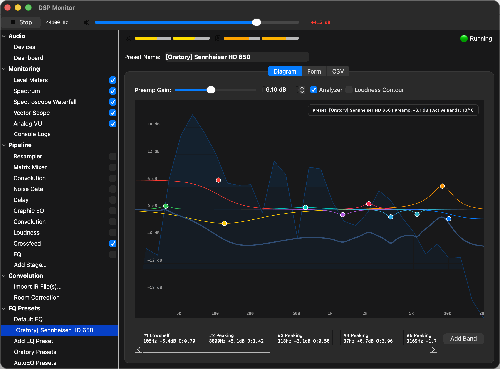
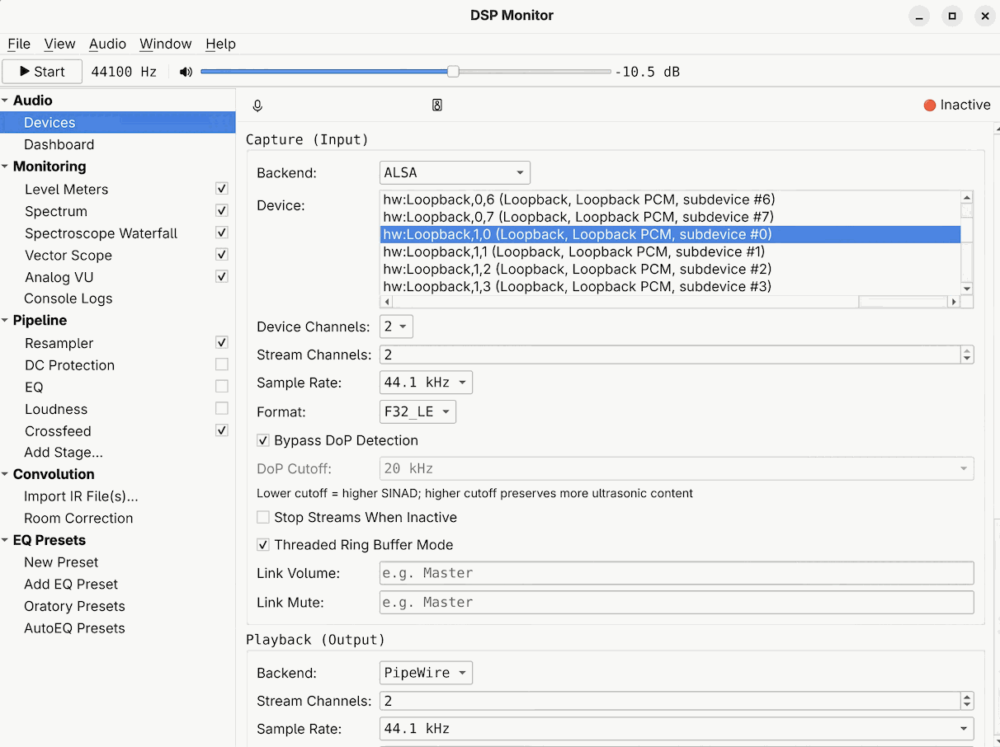
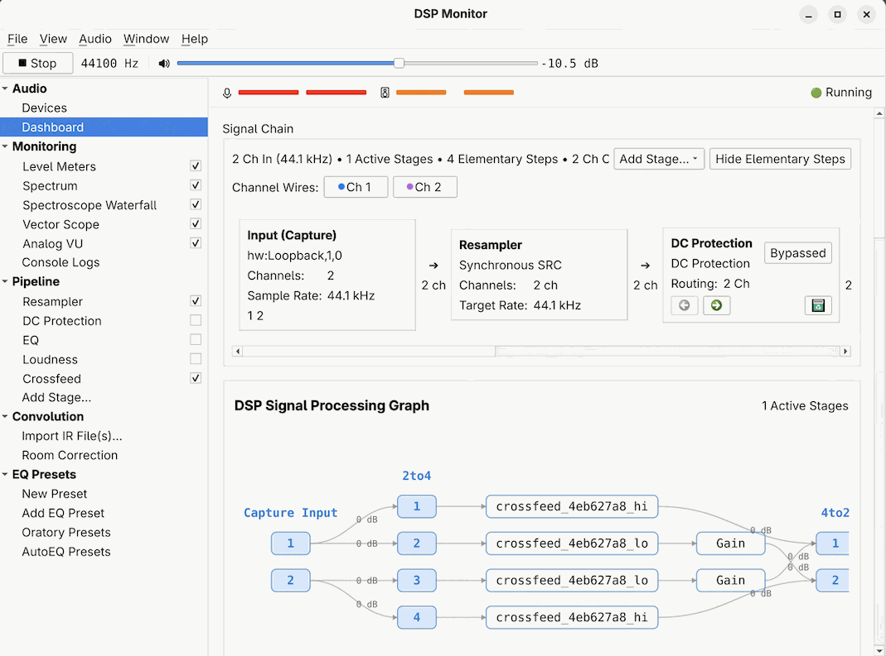

# CDSP Audio Suite

<p align="center">
  <strong>A high-performance, cross-platform audio DSP engine, CLI daemon, and Qt 6 desktop studio suite.</strong>
</p>

<p align="center">
  <a href="https://github.com/Wang-Yue/cdsp/actions/workflows/ci.yml"></a>
  <a href="https://github.com/Wang-Yue/cdsp/releases"></a>
  
  
  
  
</p>

---

## Overview

**CDSP** is a modular, high-throughput audio digital signal processing suite engineered for ultra-low latency, lock-free real-time audio routing, parametric equalization, convolution filtering, and acoustic measurement.

The repository is organized into four primary components:

1. **[Core C DSP Engine (`libcdsp`) & CLI Daemon (`cdsp`)](docs/ENGINE.md)**:
   A lightweight, drop-in replacement for CamillaDSP with hardware SIMD acceleration (Apple Accelerate / NEON / AVX2 / FFTW3), wait-free SPSC queue concurrency, driverless macOS CoreAudio loopback, and native DSD/DoP decoding and encoding.
2. **[CDSP Studio (`cdsp-studio`)](studio/README.md)**:
   A cross-platform Qt 6 / C++ desktop application providing real-time DSP signal chain visualization, interactive parametric EQ design, FIR impulse response filtering, acoustic room correction wizards, headphone AutoEQ / Oratory1990 preset databases, and floating mini-players.
3. **[Chrome Extension & WebAssembly AudioWorklet (`extension/`)](extension/README.md)**:
   A high-performance Web Audio DSP extension for Google Chrome running the compiled CDSP C core via SIMD-accelerated WebAssembly (`cdsp_wasm.wasm`), providing real-time tab audio filtering, parametric EQ presets, true peak/RMS VU meters, and 48-band spectrum analysis.
4. **[ALSA Rate Notify Plugin (`plugins/`)](plugins/README.md)**:
   A native Linux ALSA `ioplug` module enabling automatic, bit-perfect sample rate and format switching over `snd-aloop` without audio drops.

---

## Downloads

Standalone, pre-built packages of **CDSP Studio** and the **Chrome Extension** are automatically published weekly:

| Platform | Format | Direct Download |
| :--- | :--- | :--- |
| 🍏 **macOS** (Apple Silicon) | Standalone `.app` bundle | [CDSPStudio-macOS-arm64.zip](https://github.com/Wang-Yue/cdsp/releases/download/weekly/CDSPStudio-macOS-arm64.zip) |
| 🐧 **Linux** (x86_64) | Standalone AppImage | [CDSPStudio-Linux-x86_64.AppImage](https://github.com/Wang-Yue/cdsp/releases/download/weekly/CDSPStudio-Linux-x86_64.AppImage) |
| 🪟 **Windows** (x86_64) | Standalone Executable | [CDSPStudio-Windows-x86_64.exe](https://github.com/Wang-Yue/cdsp/releases/download/weekly/CDSPStudio-Windows-x86_64.exe) |
| 🌐 **Chrome Extension** (WebAssembly) | Standalone Zip Bundle | [cdsp_extension.zip](https://github.com/Wang-Yue/cdsp/releases/download/weekly/cdsp_extension.zip) |

> All builds, tags, and checksums (`SHA256SUMS.txt`) are available on the **[Releases](https://github.com/Wang-Yue/cdsp/releases)** page. Downloads are 100% public and do not require a GitHub account.

---

## Screenshots









---

## Project Structure

```text
cdsp/
├── CMakeLists.txt              # Root CMake build configuration
├── src/                        # Core C DSP engine (audio, backend, config, dsd, engine, filters, resampler)
├── include/                    # Public C API headers (include/cdsp/cdsp.h)
├── app/                        # CLI daemon & WebSocket RPC server entry point
│   ├── main.c
│   └── server/
├── studio/                     # CDSP Studio (Qt 6 / C++ GUI application)
│   ├── CMakeLists.txt
│   ├── main.cpp                # Qt application entry point
│   ├── ui/                     # Views, plots, dialogs, visualizers, mini-player
│   ├── models/                 # Audio devices, presets, monitoring, pipeline models
│   ├── engine/                 # DSP engine controller & state bridge
│   ├── room_correction/        # AutoFit curve fitting, sweeps, subwoofer assist
│   ├── resources/              # Icons (app.icns/app.png), QRC resource bundle
│   ├── cmake/
│   └── README.md
├── extension/                  # Chrome Extension & WebAssembly AudioWorklet
│   ├── manifest.json           # Manifest V3 configuration
│   ├── wasm/                   # C WebAssembly glue (cdsp_wasm.c)
│   ├── worklet/                # AudioWorklet processor (cdsp-processor.js)
│   ├── background/             # Service worker (service_worker.js)
│   ├── offscreen/              # Web Audio host document (offscreen.js)
│   ├── ui/                     # Popup dashboard & spectrum visualizer (popup.js/html/css)
│   └── README.md
├── plugins/                    # ALSA rate and format notification plugin for Linux
│   ├── CMakeLists.txt
│   ├── pcm_rate_notify.c
│   └── README.md
├── docs/                       # Technical specifications, audits, and architecture deep dives
│   ├── ENGINE.md               # Core engine architecture & benchmark evaluation
│   ├── engine_state_management.md # Real-time state machine & thread concurrency model
│   ├── dsp_engine_public_api_alignment.md # Public C API dispatch contract
│   └── callgraph_audit_report.md # Real-time audio loop zero-lock/zero-alloc audit
├── tests/                      # Full unit, integration, and benchmark test suite
└── tools/                      # Code generation, schema generators, and callgraph AST audit tools
```

---

## Key Features

- ⚡ **High-Throughput Real-Time Audio**: Up to **1.8x faster** filter execution and **1.7x faster** resampling throughput with full multi-threaded dynamic scheduling (Apple GCD / OpenMP).
- 🔒 **Zero-Lock & Zero-Allocation Audio Loops**: Verified by automated AST Call Graph Auditing to ensure steady-state audio threads never acquire mutexes or invoke dynamic memory allocators.
- 🪟 **Rich Desktop Experience**: Full-featured Qt 6 GUI with interactive frequency response curves, vector scopes, waterfall spectrograms, VU meters, and AutoEQ database integration.
- 🌐 **WebAssembly & Chrome Extension**: Run the full double-precision C DSP engine inside browser tabs via Web Audio AudioWorklet with SIMD acceleration (`cdsp_wasm.wasm`), 48-band spectrum visualization, and hot-swap filter configuration.
- 🎧 **Native DSD & DoP Support**: In-place decoding and encoding for DSD64–DSD512 and DoP carrier streams.
- 🍏 **Driverless macOS Loopback**: Native process-level and hardware-level audio capture via `CATapDescription` without third-party virtual audio cables.
- 🐧 **Bit-Perfect Linux Switching**: ALSA rate notify plugin intercepts player sample rate transitions and coordinates dynamic engine restarts.

---

## Building from Source

### Prerequisites & Dependencies

- **C/C++ Compiler**: C11 and C++17 compatible compiler (Clang, GCC, or MSVC)
- **CMake**: `3.20` or newer
- **FFTW3**: Double & single precision FFT libraries (`libfftw3`, `libfftw3f`)
- **libyaml**: YAML 1.1 parser and emitter library (`libyaml`)
- **cJSON**: Ultralightweight JSON parser/generator library (`libcjson`)
- **Qt 6** *(Required for CDSP Studio GUI)*: `Core`, `Widgets`, `Network`, `Concurrent`, `Multimedia`

#### macOS (Homebrew)
```bash
brew install cmake fftw libyaml cjson libwebsockets qt
```

#### Linux (Debian / Ubuntu)
```bash
sudo apt-get update && sudo apt-get install -y \
    build-essential cmake \
    libfftw3-dev libyaml-dev libcjson-dev libwebsockets-dev \
    libasound2-dev libpipewire-0.3-dev libdbus-1-dev \
    qt6-base-dev qt6-multimedia-dev
```

#### Windows (MSYS2 UCRT64)
In the MSYS2 UCRT64 shell:

**Option A: Static Standalone Build (Recommended - Zero DLL dependencies)**
```bash
pacman -S --needed \
    mingw-w64-ucrt-x86_64-gcc \
    mingw-w64-ucrt-x86_64-cmake \
    mingw-w64-ucrt-x86_64-ninja \
    mingw-w64-ucrt-x86_64-fftw \
    mingw-w64-ucrt-x86_64-libyaml \
    mingw-w64-ucrt-x86_64-cjson \
    mingw-w64-ucrt-x86_64-libwebsockets \
    mingw-w64-ucrt-x86_64-qt6-static
```

**Option B: Dynamic Build (Shared DLLs)**
```bash
pacman -S --needed \
    mingw-w64-ucrt-x86_64-gcc \
    mingw-w64-ucrt-x86_64-cmake \
    mingw-w64-ucrt-x86_64-ninja \
    mingw-w64-ucrt-x86_64-fftw \
    mingw-w64-ucrt-x86_64-libyaml \
    mingw-w64-ucrt-x86_64-cjson \
    mingw-w64-ucrt-x86_64-libwebsockets \
    mingw-w64-ucrt-x86_64-qt6-base \
    mingw-w64-ucrt-x86_64-qt6-multimedia
```

---

### Build Commands

#### 1. Full Build (Core Engine, Daemon & CDSP Studio)

```bash
cmake -B build -S .
cmake --build build -j
```

The compiled binaries will be placed in `build/bin/`:
- `build/bin/cdsp` (`cdsp.exe` on Windows) — Core DSP CLI daemon & WebSocket RPC server
- `build/bin/CDSPStudio` (`CDSPStudio.exe` on Windows, `.app` on macOS) — Qt 6 Desktop GUI Studio

> **Note for Windows**: On Windows (MinGW-w64 / GCC), `ENABLE_STATIC_WINDOWS=ON` is enabled by default. When built with `mingw-w64-ucrt-x86_64-qt6-static`, `cdsp.exe` and `CDSPStudio.exe` are compiled as **fully static standalone executables** with zero runtime third-party DLL dependencies. If using shared/dynamic Qt packages, configure with `-DENABLE_STATIC_WINDOWS=OFF`:
> ```bash
> cmake -B build -S . -DENABLE_STATIC_WINDOWS=OFF
> cmake --build build -j
> ```
> 
> **Parallelization (OpenMP vs. libdispatch / GCD)**:
> - **OpenMP (`ENABLE_OPENMP=ON`, default)**: Supports fully static linking via GCC's `libgomp.a` with zero external DLLs.
> - **libdispatch (`-DENABLE_OPENMP=OFF -DENABLE_LIBDISPATCH=ON`)**: Supported on Windows via `mingw-w64-ucrt-x86_64-libdispatch`. Because MSYS2 packages `libdispatch` solely as a shared dynamic library (`libdispatch.dll`), using `libdispatch` on Windows requires dynamic linking (`-DENABLE_STATIC_WINDOWS=OFF`).

#### 2. Headless Build (Core Engine & CLI Daemon Only)

If building on headless servers, embedded devices, or minimal environments without Qt:

```bash
cmake -B build -S . -DENABLE_STUDIO=OFF
cmake --build build -j
```

#### 3. Chrome Extension & WebAssembly Build (Emscripten)

Compile the CDSP C engine core to WebAssembly (`cdsp_wasm.wasm`) and package the Google Chrome Extension:

```bash
# Set up Emscripten SDK environment
source /path/to/emsdk/emsdk_env.sh

# Configure and build
emcmake cmake -B build-wasm -S .
cmake --build build-wasm -j

# Run WebAssembly bit-correctness and lifecycle test suite
node build-wasm/test_wasm.js
```

This generates:
- `build-wasm/extension_dist/` — Clean unpacked directory for Chrome Developer Mode (`chrome://extensions` -> *Load unpacked*).
- `build-wasm/cdsp_extension.zip` — Compressed standalone extension bundle for distribution.

#### 4. Run Test Suite

```bash
# Native test suite (all backends, filters, pipelines, and processors)
ctest --test-dir build -j --output-on-failure
```

#### 5. Code Formatting & Static Analysis

```bash
# Format all C/C++ source and header files
cmake --build build --target format

# Check formatting without modifying files
cmake --build build --target format-check

# Run Include-What-You-Use (IWYU) analysis
cmake --build build --target iwyu
```

---

## Documentation

- 📖 **[Core DSP Engine Deep Dive](docs/ENGINE.md)** — In-depth concurrency design, benchmarks, and performance evaluation.
- 🎨 **[CDSP Studio Guide](studio/README.md)** — GUI features, screenshots, and acoustic wizards.
- 🌐 **[Chrome Extension & WebAssembly Guide](extension/README.md)** — Browser tab audio capture, AudioWorklet DSP pipeline, and WASM integration.
- 🔄 **[Engine State Management Specification](docs/engine_state_management.md)** — Lock-free thread coordination and atomic state machine.
- 🔌 **[Public C API Specification](docs/dsp_engine_public_api_alignment.md)** — Direct C library embedding and FFI dispatch contract.
- 🔬 **[Static Call Graph Audit Report](docs/callgraph_audit_report.md)** — Formal verification of zero-lock and zero-allocation hot paths.

---

## License & Attribution

CDSP is licensed under the **[GNU General Public License v3.0 (GPLv3)](LICENSE)**. Full copyright notices for upstream works and contributors are preserved in the **[NOTICE](NOTICE)** file.
