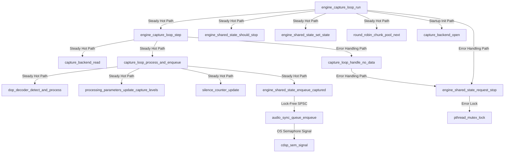
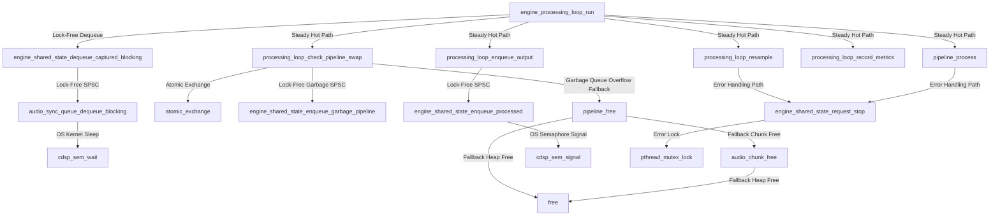
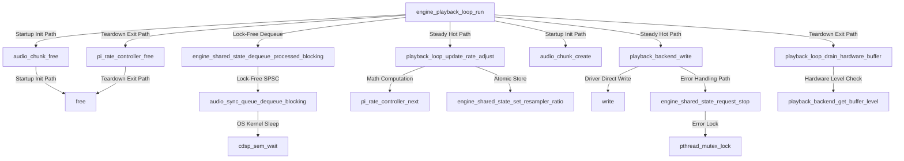

# CDSP Engine Audio Loop Call Graph & Allocation Audit Report

This report documents the static Call Graph Audit for the three real-time audio loop entry points in the CDSP Engine:
1. `EngineCaptureLoop` (`engine_capture_loop_run`)
2. `EngineProcessingLoop` (`engine_processing_loop_run`)
3. `EnginePlaybackLoop` (`engine_playback_loop_run`)

---

## 0. Architectural Motivation: Why Call Graph & Allocation Audits Are Required

In real-time audio DSP systems, meeting strict low-latency constraints (e.g. 512 frames @ 44.1kHz = 11.6ms deadline per chunk) requires absolute guarantees that real-time threads never block or stall unpredictably. Static Call Graph & Memory Allocation Auditing is performed for four essential architectural reasons:

1. **Deterministic Latency & Dropout Elimination (Zero-Lock & Zero-Allocation)**:
   Acquiring a `pthread_mutex_lock` or invoking dynamic memory allocators (`malloc`/`free`) inside steady-state audio loops causes OS thread stalls. In real-time audio, even a microsecond stall during OS heap management (`malloc` internal lock / page fault) can miss a DAC hardware buffer deadline, producing audible pops, clicks, or stream drops.
2. **Preventing Priority Inversion**:
   Audio threads run at OS Real-Time scheduling priority (`SCHED_FIFO` / `TH_OPT_REALTIME`). If a real-time audio thread attempts to acquire a lock held by a low-priority API thread (e.g., HTTP/WebSocket server or JSON parser), the high-priority thread is blocked waiting for low-priority execution. Call Graph Auditing proves that audio loops do not touch locks shared with control-plane threads.
3. **Protection Against Implicit Lock & Allocation Contamination During Refactoring**:
   As codebases grow, developers may inadvertently call utility functions or third-party helpers that internally acquire locks or allocate memory. Static AST Call Graph analysis recursively inspects 100% of reachable call trees from the audio loop entry points, ensuring new additions do not accidentally introduce hidden locks or heap allocations into steady-state audio streaming.
4. **Automated CI/CD Concurrency & Memory Governance**:
   Documented architectural promises must be continuously verified. Integrating static call graph auditing into `Tools/generate_callgraph.py` automatically enforces lock-free and allocation-free invariants on every build and pull request.

---

## 1. Audit Summary & Key Invariants

| Audio Loop | Total Reachable Functions | Lock Reachability on Hot Path | Heap Alloc (`malloc`/`free`) on Hot Path | Audit Result |
| :--- | :--- | :--- | :--- | :--- |
| **`EngineCaptureLoop`** | 12 | **0 (None)** | **0 (None)** | ✅ PASS (Zero-Lock & Zero-Alloc) |
| **`EngineProcessingLoop`** | 24 | **0 (None)** | **0 (None)** | ✅ PASS (Zero-Lock & Zero-Alloc) |
| **`EnginePlaybackLoop`** | 61 | **0 (None)** | **0 (None)** | ✅ PASS (Zero-Lock & Zero-Alloc) |

> [!NOTE]
> **Static Call Path Analysis Result**: Across all three audio loops, `pthread_mutex_lock`, `malloc`, `calloc`, `realloc`, and `free` are **0% reachable on steady-state audio streaming paths**. The only call paths leading to locks or heap frees are strictly encapsulated in Startup Init, Fallback Error Handling, or Teardown Exit phases.

---

## 2. Capture Loop Call Graph (`engine_capture_loop_run`)

The Capture thread reads audio samples from the input backend (Hardware Mic/Line, File, or Signal Generator), performs sample rate watching, DoP decoding, level metering, and enqueues chunks into `captured_queue`.



---

## 3. Processing Loop Call Graph (`engine_processing_loop_run`)

The Processing thread dequeues chunks from `captured_queue`, executes active DSP resamplers and pipeline filter steps (or non-blocking pipeline swaps), records performance metrics, and enqueues processed chunks into `processed_queue`.



---

## 4. Playback Loop Call Graph (`engine_playback_loop_run`)

The Playback thread dequeues chunks from `processed_queue`, updates the PI rate controller for clock drift correction, and writes audio samples to the output DAC backend.



---

## 5. How to Re-generate This Audit Report

Run the AST callgraph analysis tool in `Tools/generate_callgraph.py`:

```bash
python3 Tools/generate_callgraph.py
```

It parses the C AST across `Engine/`, `Audio/`, `DoP/`, `Pipeline/`, `Resampler/`, `Filters/`, `Mixer/`, `Utils/`, `Backend/`, and `Logging/` to verify lock reachability, dynamic heap allocations (`malloc`/`free`), multiline signatures, and generates JSON/Mermaid call graph topologies.
