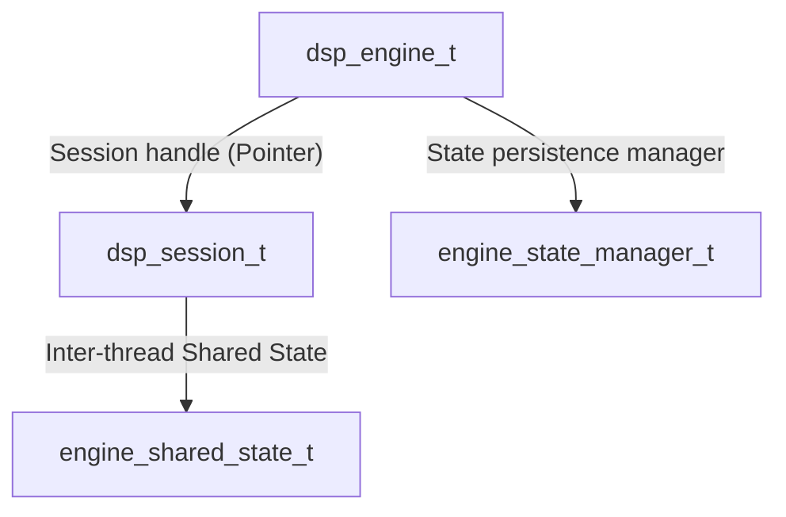
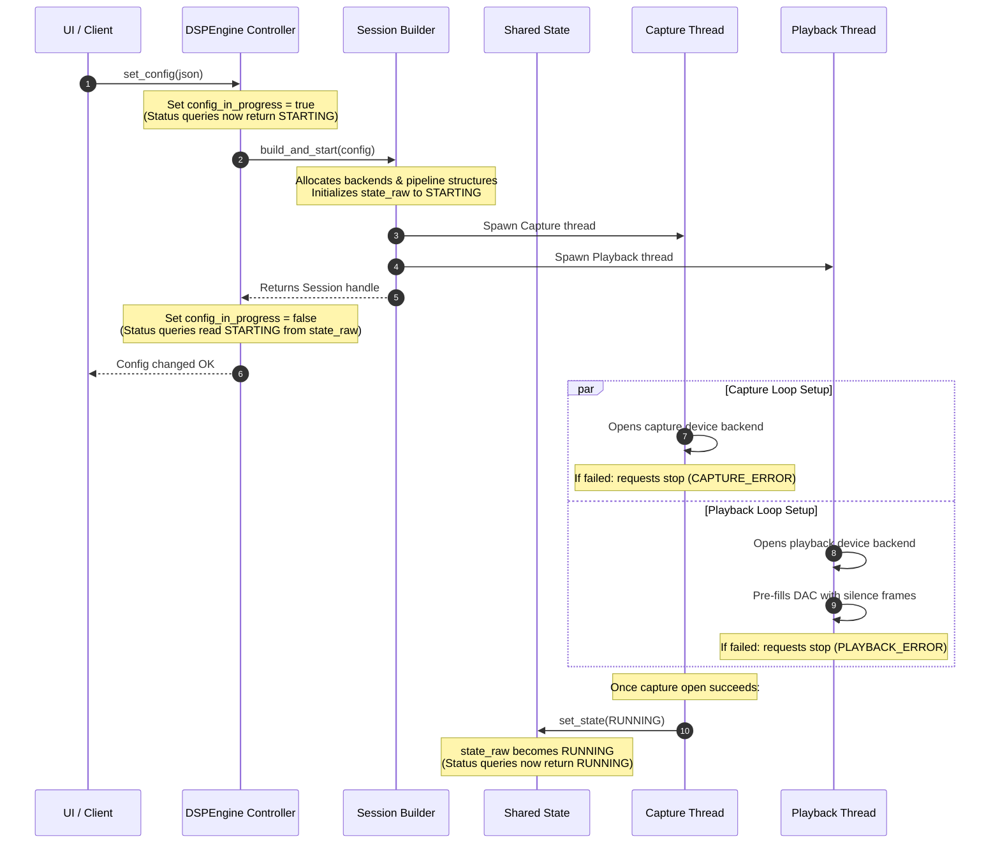
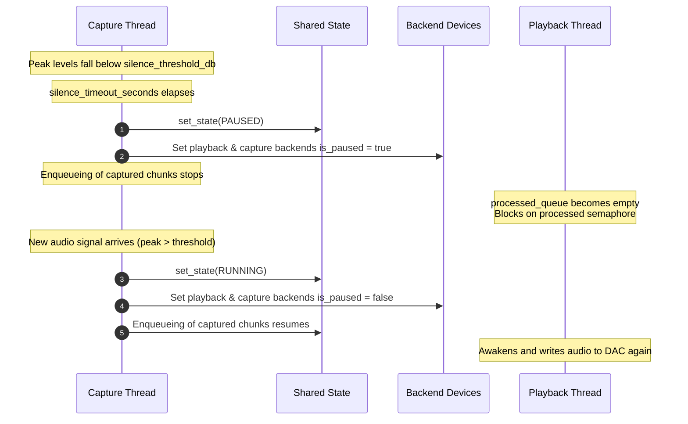
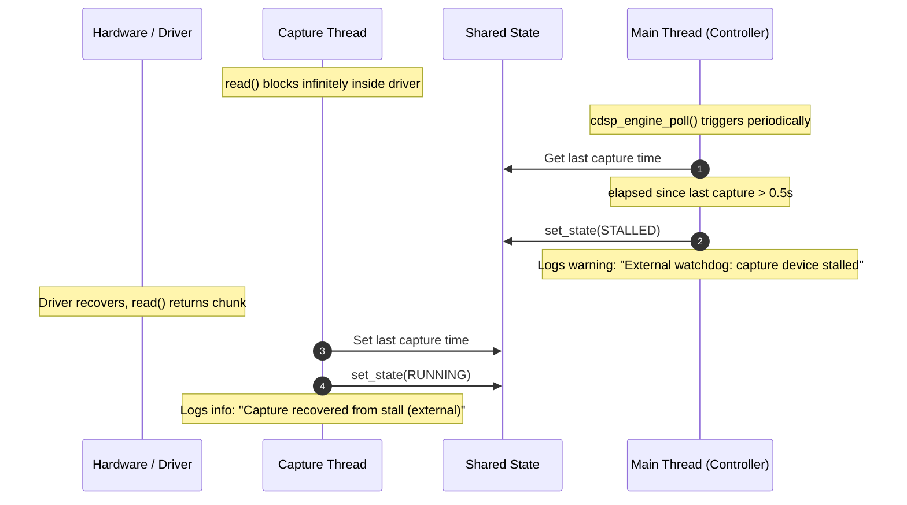
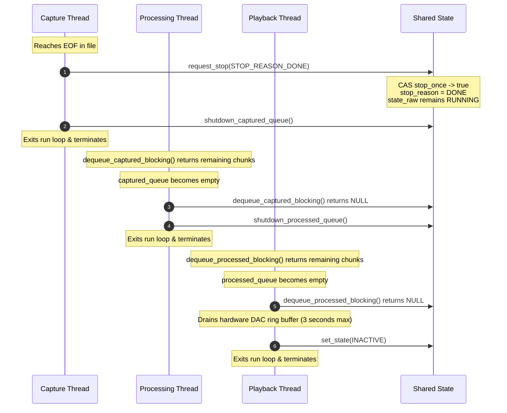
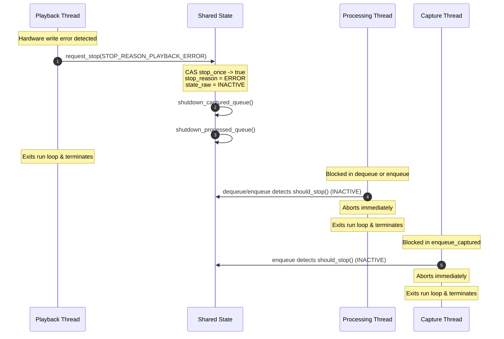

# CDSP Engine State Management Architecture

This document provides a detailed, step-by-step technical guide on how the CDSP Engine manages state transitions, synchronization flags, thread interactions, and queue teardowns. It is designed to help you navigate the "state flag" relationships when modifying startup, playback, or shutdown paths.

---

## 1. Key State Variables & Structs Reference

The state is managed across three layers: the Engine controller (`dsp_engine_t`), the Session builder/teardown (`dsp_session_t`), and the Inter-thread synchronizer (`engine_shared_state_t`).



### 1.1. Inter-Thread Level (`engine_shared_state_t`)
Defined in [engine_shared_state.c](Engine/engine_shared_state.c). This struct is shared directly among the Capture, Processing, and Playback threads and is 100% lock-free.

| Field Name | Type | Purpose | Concurrency Model |
| :--- | :--- | :--- | :--- |
| `state_raw` | `_Atomic uint8_t` | Encodes `processing_state_t` (`INACTIVE`, `RUNNING`, `PAUSED`, `STALLED`). When set to `INACTIVE`, it serves as the global stop signal. | Lock-free atomic reads (`acquire` ordering) and writes (`release` ordering). |
| `stop_once` | `_Atomic bool` | A latch/flag indicating whether a stop sequence has been initiated. Prevents multiple stop requests from colliding. | Checked and set atomically via Compare-And-Swap (CAS) `atomic_compare_exchange_strong_explicit`. |
| `stop_reason` | `processing_stop_reason_t` | A 264-byte struct containing the type of stop, error messages, or format change samplerates. | Read and written under protection of `stop_reason_mutex`. |
| `stop_reason_mutex` | `pthread_mutex_t` | Mutex protecting `stop_reason` against concurrent read/write data races. | C11 Mutex Lock (isolated from hot-path processing loop). |
| `captured_queue` | `audio_sync_queue_t*` | Sync queue from Capture -> Processing. | Lock-free SPSC + OS semaphore. |
| `processed_queue` | `audio_sync_queue_t*` | Sync queue from Processing -> Playback. | Lock-free SPSC + OS semaphore. |
| `last_capture_time_ns` | `_Atomic uint64_t` | Telemetry timestamp of the last successfully captured chunk in nanoseconds. Checked by the external watchdog to detect driver freezes. | Lock-free atomic reads and writes (`relaxed` ordering). |

---

### 1.2. Session Level (`dsp_session_t`)
Defined in [dsp_session_internal.h](Engine/dsp_session_internal.h). Manages resource lifetimes (backends, resampler, threads, chunk pools).

| Field Name | Type | Purpose | Concurrency Model |
| :--- | :--- | :--- | :--- |
| `threads_created` | `bool` | Set to `true` if all worker threads spawned successfully. If `false`, teardown skips calling `pthread_join` to prevent hangs. | Thread-confined (touched only on the main controller thread). |
| `config_mutex` | `pthread_mutex_t` | Guards access to the `current_config` pointer. | C11 Mutex Lock. |
| `current_config` | `dsp_config_t*` | Pointer to the active session config. | Protected by `config_mutex`. |

---

### 1.3. Controller Level (`dsp_engine_t`)
Defined in [dsp_engine.c](Engine/dsp_engine.c). The top-level controller interfacing with the Server and user commands, structured into domain sub-groups (`session`, `buffers`, `config`).

| Field Name | Type | Purpose | Concurrency Model |
| :--- | :--- | :--- | :--- |
| `state_mutex` | `pthread_mutex_t` | Serializes configuration changes, volumes, and status queries. | C11 Mutex Lock. |
| `session.last_stop_reason` | `processing_stop_reason_t` | Persists the stop reason (e.g. EOF or Error) returned by `dsp_session_stop_and_free()` after session destruction. | Protected by `state_mutex`. |
| `session.has_last_stop_reason` | `bool` | Flag indicating if `last_stop_reason` holds a valid stopped/error state. | Protected by `state_mutex`. |
| `config.in_progress` | `_Atomic bool` | True if a configuration change or reload is actively running. Status queries check this flag to return `STARTING` without blocking on `state_mutex`. | Lock-free atomic reads and writes. |

---

### 1.4. State Persistence Level (`engine_state_manager_t`)
Defined in [engine_state_manager.h](Engine/engine_state_manager.h). Manages fader volume/mute settings, config path, and state file serialization.

| Field Name | Type | Purpose | Concurrency Model |
| :--- | :--- | :--- | :--- |
| `fader_volumes` | `_Atomic double[5]` | Target volume levels in dB for audio faders. | Lock-free atomic reads and writes. |
| `fader_mutes` | `_Atomic bool[5]` | Target mute flags for audio faders. | Lock-free atomic reads and writes. |
| `state_file_path` | `char[1024]` | Path to state persistence file on disk. | Protected by `mutex`. |
| `active_config_path` | `char[1024]` | Path to active configuration file. | Protected by `mutex`. |
| `change_counter` | `uint64_t` | Monotonic counter tracking state modifications. | Protected by `mutex`. |

---

## 2. State Transition Matrices

### 2.1. Core Processing States (`processing_state_t`)
The raw state of the engine is stored in `state_raw` inside `engine_shared_state_t`:

```
                     ┌──────────────┐
                     │   INACTIVE   │◀──────────────────────────────┐
                     └──────────────┘                               │
                            │ (set config)                          │
                            ▼                                       │
                     ┌──────────────┐                               │
                     │   STARTING   │                               │
                     └──────────────┘                               │
                            │ (spawn threads)                       │
                            ▼                                       │ (abort or error)
                     ┌──────────────┐                               │
                     │   RUNNING    │───────────────────────────────┤
                     └──────────────┘                               │
                       ▲          │                                 │
    (signal detected)  │          │ (no signal / silence timeout)   │
                       │          ▼                                 │
                     ┌──────────────┐                               │
                     │    PAUSED    │───────────────────────────────┘
                     └──────────────┘
```

* **`INACTIVE`**: Threads are stopped or in the process of shutting down. `engine_shared_state_should_stop()` returns `true`.
* **`STARTING`**: The engine is active but in the process of rebuilding/restarting its session (e.g. opening device backends, pre-filling silence, spawning threads). Status queries return this state instantly without blocking.
* **`RUNNING`**: Active audio capture and playback.
* **`PAUSED`**: Audio levels are below the silence threshold. Worker loops still run but backends are paused to yield CPU time.
* **`STALLED`**: The watchdog detected that no chunks have arrived from the hardware capture backend for too long, indicating driver or hardware starvation.

---

## 3. Thread Lifecycles & State Scenarios

The engine progresses through several lifecycle phases, moving between states according to hardware feedback, queue levels, and user inputs.

---

### 3.1. Startup & Initialization Flow
This scenario starts when a new configuration is applied. The engine goes into `STARTING` state while it initializes synchronously, then spawns the real-time audio threads. The threads open device backends asynchronously, and once capture starts successfully, it transitions the state to `RUNNING`.



1. **Config change triggers `STARTING`**:
   - `dsp_engine_set_config()` sets `config_in_progress` to `true`.
   - The session builder initializes the shared state's `state_raw` to `PROCESSING_STATE_STARTING`.
   - The session builder allocates the resampler, processing pipeline, and backend structures (without opening hardware).
2. **Asynchronous Startup Spawning**:
   - The builder spawns the Capture, Processing, and Playback loops in parallel.
   - The builder returns the session handle to the engine, which sets `config_in_progress` to `false`. The client's command returns successfully.
3. **Hardware Open & Prefill on Loop Threads**:
   - The **Playback Thread** opens the playback device backend and pre-fills silence frames (using DSD silence if DSD is active) asynchronously.
   - The **Capture Thread** opens the capture device backend.
   - If either backend fails to open, it requests an immediate abort with the specific error reason.
4. **Transition to `RUNNING`**:
   - Once the capture thread successfully opens its device, it sets the shared state to `PROCESSING_STATE_RUNNING`.

---

### 3.2. Steady-State Audio Loops
Once started, audio chunks flow continuously through SPSC queues synchronized by low-overhead OS semaphores.

```mermaid
graph LR
    H_In[Capture Mic/Line] -->|hardware read| C[Capture Loop]
    C -->|pool chunk| S_Cap[captured_queue SPSC]
    S_Cap -->|blocking dequeue| P[Processing Loop]
    P -->|process pipeline| S_Proc[processed_queue SPSC]
    S_Proc -->|blocking dequeue| K[Playback Loop]
    K -->|hardware write| H_Out[Playback DAC/Line]
```



* **Capture Loop**: Obtains a pre-allocated chunk from `capture_pool`, reads PCM/DSD from the device backend, runs metering/silence checks, and pushes to `captured_queue`. It then signals `captured_queue`'s semaphore.
* **Processing Loop**: Blocks on `captured_queue`'s semaphore. Once awakened, it dequeues the chunk, runs it through the DSP pipeline (resampler, mixers, channels, volume/mute), obtains a scratch chunk from the pool, copies the output, and enqueues it to `processed_queue`, signaling its semaphore.
* **Playback Loop**: Blocks on `processed_queue`'s semaphore. Once awakened, it dequeues the processed chunk, runs the rate-adjust controller, and writes the frame samples to the physical playback backend.

---

### 3.3. Silence Auto-Pause & Resume Flow
If silence detection is enabled, the capture loop auto-pauses the downstream pipeline to save CPU and stops writing to the output device when silence is sustained.



1. **Silence Detection**:
   - The capture loop monitors the peak levels of each chunk.
   - If the level stays below the threshold for longer than the timeout, the silence counter updates.
2. **Auto-Pause Transition**:
   - The capture thread updates the state to `PROCESSING_STATE_PAUSED`.
   - It pauses both capture and playback backends. In paused mode, backends yield CPU cycles.
   - The capture thread stops pushing active audio chunks to `captured_queue`.
   - **Periodic 0-Frame Ticks**: To prevent configuration hot-reloads (pipeline swaps) or parameter updates (volume/mute) from being delayed indefinitely during silence, the capture thread periodically enqueues empty chunks (`valid_frames == 0`) downstream every 200ms.
   - The processing thread wakes up on these 0-frame chunks, checks and performs any pending pipeline swaps, and propagates them downstream.
   - The playback thread blocks on `processed_queue` and drops 0-frame chunks immediately to bypass hardware writes and rate controllers.
3. **Signal Auto-Resume**:
   - When a loud chunk is read (above the threshold), the silence counter resets.
   - The capture thread sets the state back to `PROCESSING_STATE_RUNNING`.
   - Both backends are unpaused, and chunk pushing resumes, waking up the downstream threads.

---

### 3.4. Watchdog Stall & Recovery Flow
The watchdog monitors hardware starvation. If the driver halts or the device is disconnected without throwing a direct backend error, the engine transitions to `STALLED`.



1. **Stall Detection**:
   - During normal reads, the capture thread updates the shared timestamp `last_capture_time_ns` in the shared state every time a chunk is read.
   - If the capture backend read call blocks infinitely (e.g., driver freeze or hardware disconnect), the capture thread remains blocked inside `capture_backend_read` and cannot execute internal checks.
   - The main controller thread running `cdsp_engine_poll()` reads the shared `last_capture_time_ns` periodically.
   - If the elapsed time since `last_capture_time_ns` exceeds `0.5` seconds, the main thread transitions `state_raw` to `PROCESSING_STATE_STALLED` and logs a warning. This ensures status queries show `STALLED` even when the capture thread is permanently hung.
2. **Stall Recovery**:
   - The capture thread keeps waiting/reading. If the device/driver recovers and successfully delivers a new chunk, the capture thread updates `last_capture_time_ns` in shared state.
   - The capture thread checks if the shared state is currently `PROCESSING_STATE_STALLED`. If so, it transitions it back to `PROCESSING_STATE_RUNNING` and logs a recovery message.

---

### 3.5. Graceful EOF Teardown (Queue Drain)
Used when a finite file input completes. The goal is to let the remaining audio drain through all buffers to the DAC.



1. **Capture Loop Reaches EOF**: 
   - Calls `engine_shared_state_request_stop(state, STOP_REASON_DONE)`.
   - CAS on `stop_once` succeeds. `stop_reason` is set to `STOP_REASON_DONE`.
   - **Crucial**: The state is **not** set to `INACTIVE`. `state_raw` remains `RUNNING`.
   - Calls `audio_sync_queue_shutdown(captured_queue)`.
2. **Processing Loop Drains Capture Queue**:
   - Keeps dequeuing chunks from `captured_queue` and processing them.
   - Once all chunks are drained, `dequeue_captured_blocking` returns `NULL`.
   - The processing thread exits its `while(1)` loop, then calls `engine_shared_state_shutdown_processed_queue(state)`.
3. **Playback Loop Drains Playback Queue**:
   - Dequeues and plays all remaining processed chunks.
   - Once `processed_queue` is empty, `dequeue_processed_blocking` returns `NULL`.
   - The playback thread runs `playback_loop_drain_hardware_buffer` to wait for the DAC buffer to hit `0`.
   - Sets the state to `INACTIVE` via `engine_shared_state_set_state(state, PROCESSING_STATE_INACTIVE)`.
   - Playback thread terminates.

---

### 3.6. Immediate Abort Teardown
Used when a thread crashes, a hardware device is disconnected, or the user clicks "Stop". Threads must wake up and abort immediately.



1. **Playback Thread Detects Error**:
   - Calls `engine_shared_state_request_stop(state, STOP_REASON_PLAYBACK_ERROR)`.
   - CAS on `stop_once` succeeds. `stop_reason` is set to the error.
   - **Crucial**: State is immediately changed to `INACTIVE`.
   - **Crucial**: Both `captured_queue` and `processed_queue` are immediately shut down.
2. **Unblocking Worker Threads**:
   - The Capture and Processing threads might be blocked waiting on semaphores (sleeping) or blocked waiting to push to full queues (spinning).
   - Calling `shutdown` on the queues wakes up all semaphores immediately.
   - The threads check `engine_shared_state_should_stop()`, which returns `true` (since state is `INACTIVE`).
   - All loops break and threads terminate immediately.
3. **Controller Teardown**:
   - The controller joins all terminated threads and frees session allocations safely.

---

## 4. The CAS Race-Condition Safety Gate

One of the trickiest parts of shutdown is when multiple threads encounter errors simultaneously. For example:
- The capture thread encounters a read timeout error.
- At the same time, the playback thread gets a buffer underrun/write error.
- Simultaneously, the user clicks "Stop" in the UI.

Without a gate, these threads would overwrite the stop reason and attempt to shut down queues repeatedly, causing crashes or double-frees.

```c
  bool expected = false;
  if (atomic_compare_exchange_strong_explicit(&state->stop_once, &expected,
                                              true, memory_order_acq_rel,
                                              memory_order_acquire)) {
      // WINNER: Only this block executes once.
      state->stop_reason = reason;
      ...
  } else {
      // LOSER: Stop has already been requested by someone else.
      ...
  }
```

* **The First Thread (Winner)**: Atomic compare-exchange finds `stop_once` is `false`. It atomically updates it to `true` and returns `true`. It sets the initial, most accurate stop reason.
* **Subsequent Threads (Losers)**: Find `stop_once` is already `true`. They enter the `else` branch.
  - If a graceful EOF was previously requested (`stop_reason == STOP_REASON_DONE`), but a new thread requests an immediate abort (`reason.type != STOP_REASON_DONE`), the loser branch **overrides** the stop reason and forces an immediate queue shutdown.
  - Otherwise, it does not overwrite the stop reason to preserve the first error root cause.

---

## 5. Summary Cheat Sheet for Debugging

| Symptom | Probable Cause | Action |
| :--- | :--- | :--- |
| **Shutdown Hangs (Infinite Join)** | Playback thread is blocked waiting on `processed_queue`'s semaphore. | Check if `engine_shared_state_request_stop` forgot to shut down `processed_queue` on error path. |
| **Processing Spins Endless 1ms Sleeps** | EOF was requested, but playback thread terminated early, leaving the queue full. `should_stop` check was skipped because stop reason was `DONE`. | Ensure `should_stop` breaks the enqueue loop immediately regardless of the stop reason. |
| **Torn Stop Reasons / Corrupt Msg** | Thread read `state->stop_reason` concurrently while another thread was writing it. | Ensure all reads/writes of `stop_reason` are wrapped by `stop_reason_mutex` and returned by value. |
| **Double Free on Config Change** | Controller freed `config` on failure, but `dsp_session_stop_and_free` also freed it because `core->current_config` was assigned. | Ensure ownership of the `config` struct is explicitly transferred and handled only by the session on builder exit. |
